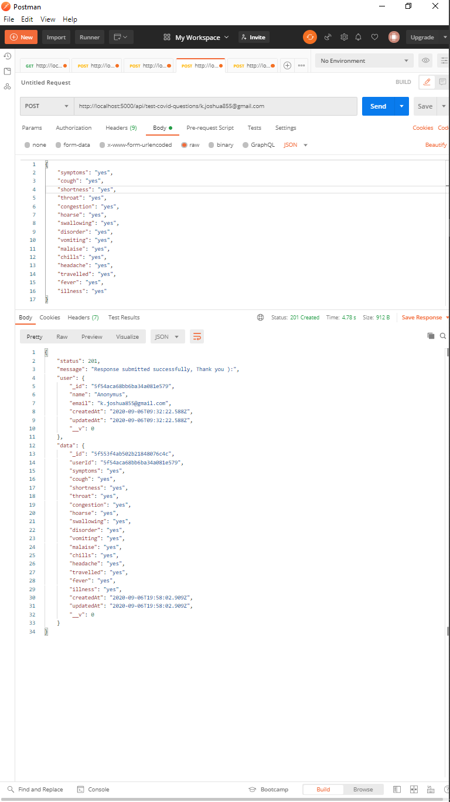

## SalonEverywhere-backend What is SalonEverywhere? 
We’re a marketplace and booking platform that safely and easily connects clients with beauty pros offering services in private or traditional venues. Private venues include your home, a stylist space or a salon suite. Traditional venues include multi-chair salons, spas &amp; barbershops.  Your Pro, Your Venue, Your Choice!
<br>

## Features

- All users who wishes they Landing on Home page of SalonEverywhere Application.
- All Users who want to complete covid-19 testwith SalonEverywhere Application.

## Test SalonEverywhere APIs

Before we get started Remember to take  :coffee:   :pizza:  and :dancer:   When You Are coding, come on Dude it all about relax

## Backend tools

 - All Neccessary libraries.
 - Express JS.
 - NodeJs.


#### TABLE OF API ENDPOINTS SPECIFICATION AND DESCRIPTION

- Version API using URL versioning starting with the letter “v”. A simple ordinal
  number would be appropriate and avoid dot notation such as 2.0. So, that why you have to add api/v2
  for each route of endpoints you want to access for example: https://saloneverywhere-backend.herokuapp.com/api/path  


|NO  | VERBS  | ENDPOINTS                            | STATUS   | ACCESS                   | DESCRIPTION                             |
|----|--------|--------------------------------------|----------|--------------------------|-----------------------------------------|
| 1  | POST   | /api/save-user                       |  201 OK  | public                   | save a user email to receive test link  |
| 2  | POST   | /api/test-covid-questions/:email     |  201 OK  | public                   | submit a user test result in database   |


#### Other Tools

Other tools and technologies used in development of this application are;
- Hoster: [Heroku](https://heroku.com/).
- Compiler: [Babel](https://babeljs.io/).
- Style Guide: [Airbnb](https://airbnb.io/projects/javascript/).
- Framework: [ExpressJS](http://expressjs.com/).
- Documentation: [Swagger](https://swagger.io/).
- Linting Library: [ESLint](https://eslint.org/).
- API Testing environment: [Postman](https://www.getpostman.com).
- Programming language: [JavaScript(ES6)](https://developer.mozilla.org/en-US/docs/Web/JavaScript/).
- Text Editor: [VSCode](https://code.visualstudio.com), [Sublime Text](https://www.sublimetext.com/).

#### Getting Start With Project

1. Clone the github repository [here](https://github.com/key-joshua/SalonEverywhere-backend.git). 

- Clone this project on your machine , by running this command on in your command line or Terminal:
 ```
git clone https://github.com/key-joshua/SalonEverywhere-backend.git
 ```
 - move to the cloned repository by running this command:
 ```
cd  SalonEverywhere-backend
 ```
 
 - Install the required dependencies found in package.json by running this command:
 ```
npm install
 ```
 - And then to start running  this project on your machine , run this command:
 ```
npm run server
```

#### Deployment

- heroku : [SalonEverywhere](https://saloneverywhere-backend.herokuapp.com/).
#### Dedicated: [SalonEverywhere-Teachnical-Test](https://docs.google.com/document/d/1LcnZ0zrGXertDPFWq8Y3VnUk2woDgDqQnucpv6_fydA/edit).

#### Develoer: [Key Joshua](https://www.instagram.com/key_joshua/).

#### Completed Tasks ScreenShots



